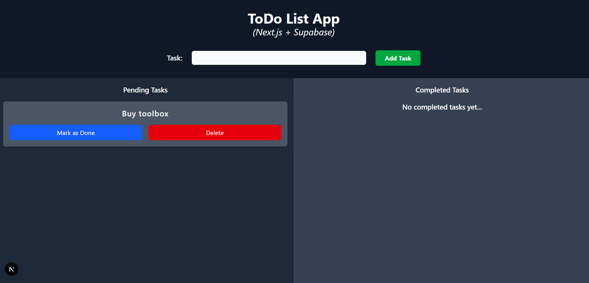

# Next.js + Supabase To Do List App
A simple CRUD app.

## Preview:


## To run this project:
1. Clone this repository `git clone https://github.com/khianvictorycalderon/Nextjs-Supabase-ToDo-List-App.git`
2. Go to your supabase project.
3. Run this SQL query in your supabase `sql editor` project:
  ```sql
  CREATE EXTENSION IF NOT EXISTS "pgcrypto";

  CREATE TABLE IF NOT EXISTS tasks(
    task_id UUID PRIMARY KEY DEFAULT gen_random_uuid(),
    task_name TEXT NOT NULL,
    status TEXT NOT NULL DEFAULT 'pending'
  );
  ```
4. Create a `.env.local` file and paste the following:
  ```env
  SUPABASE_URL=""
  SUPABASE_ANON_KEY=""
  ```
5. Replace the empty string with your actual supabase url and anon key.
6. Run `npm install`
7. Run `npm run dev`

---

## Dependencies & Configuration
The following is a list of installed dependencies and configuration settings used in this project.
You don’t need to install anything manually, as all dependencies are already managed through `package.json`.
This section is provided for reference only, to give you insight into how the project was set up.

## Dependencies
- `npm install axios`
- `npm install @supabase/supabase-js`